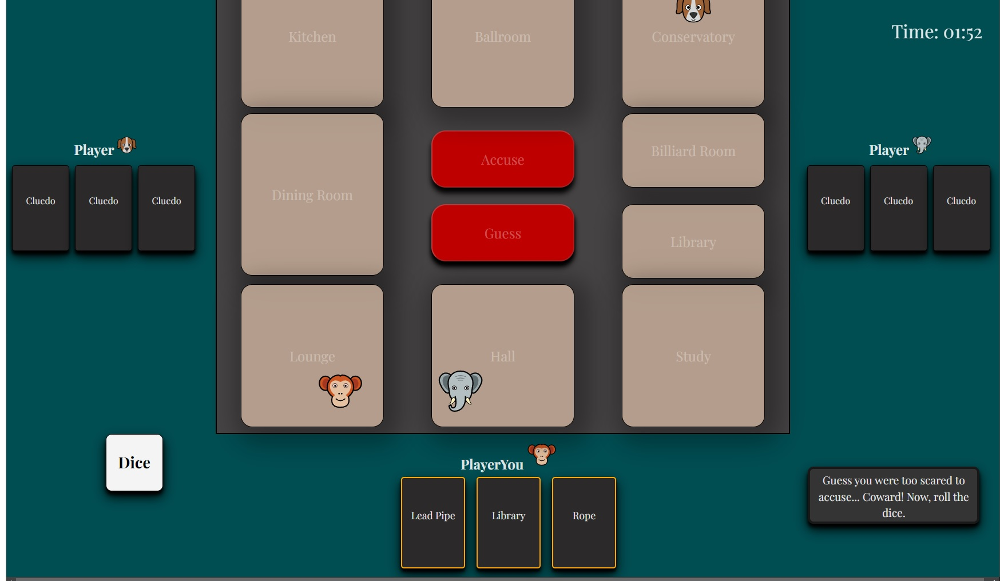

# Simplified Cluedo

This is a school project of the game Cluedo with focus on JavaScript/Typescript. This game is referenced from [Wikipedia](https://sv.wikipedia.org/wiki/Cluedo).

In this simplified version, you will take on the role as the detective, trying to identify the suspect, weapon, and location of a hypothetical murder.

To make a guess, a player will choose one of the suspects, weapons, or locations that they have not yet guessed and present it to the other players. If any player has a card that matches the guess, they must reveal it to the guessing player.

To win the game, a player must use their detective skills to gather as much information as possible through careful questioning and deduction. With each correct guess, players will narrow down the possible combinations of suspects, weapons, and locations, bringing them one step closer to solving the crime.

_Disclaimer_ This version is made to be played on a desktop layout and not for mobile and smaller tablets.

[Link to Cluedo](https://medieinstitutet.github.io/fed22d-js-grundkurs-2-cluedo-nanidam/)

## Tech Stack

**User interface**  HTML   CSS  Sass

**Functionality**  JavaScript  TypeScript

**Versioncontroll**  Git

**Tools**   Visual Studio Code   Eslint  Prettier   Vite

## Screenshots

**The Game**             

**Lighthouse** 

**Validation of HTML** 

**Validation of CSS** 
